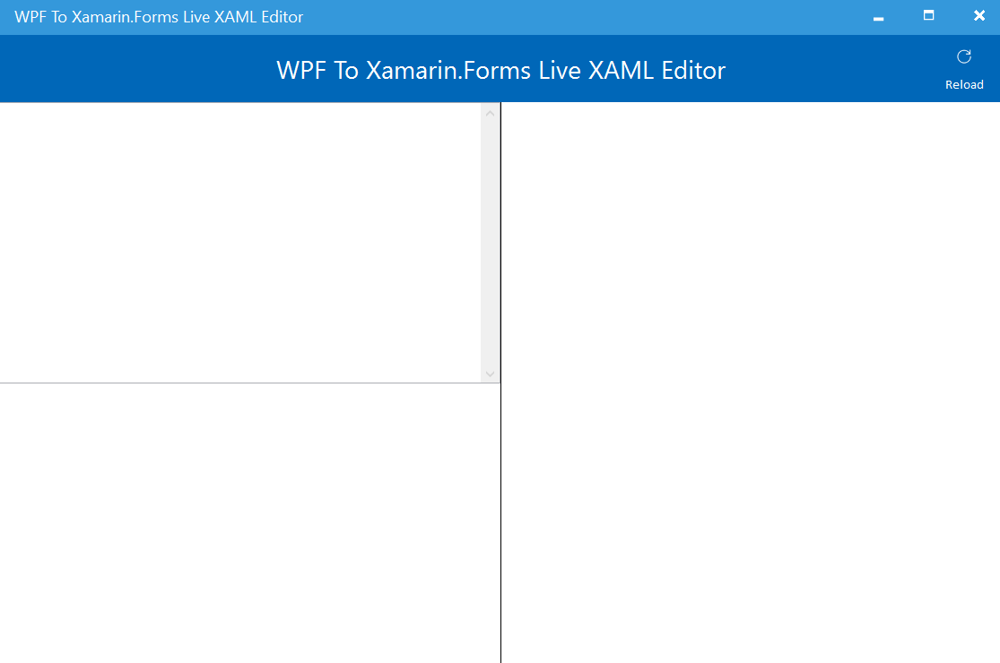

# FormsWPFConverter

**Live XAML converter from WPF to Xamarin.Forms** Tool.

***NOTE**: Experimental and work in progress project.There is still a lot of work to complete all the options.*

## Setup

Clone this repository. Open the solution in **FormsWPFLive.sln** with Visual Studio and press F5.

## Feedback 

Please use [GitHub issues](https://github.com/jsuarezruiz/FormsWPFConverter/issues) for questions, comments, feature requests, or if would like to vote on what others are recommending.

## License

Code released under the [MIT license](https://opensource.org/licenses/MIT).